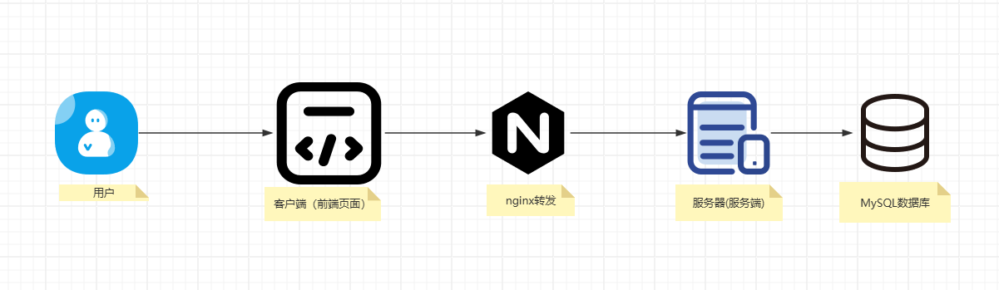

::# 项目介绍

## 零、项目背景
> 一个致力于服务中医药垂直领域的问答小助手——小岐，目前是依托于阿里云通义千问大模型`QWEN2`支持的文本的项目。


## 一、项目架构
### 1. 架构图

### 2. 技术选型
```
(1) SpringBoot框架
(2) MySql数据库
(3) SSE流式输出
(4) RxJava响应式编程
(5) Quartz定时任务
(6) MybatisPlus持久化框架
(7) NginxWeb服务器
```
## 二、项目当前(20240801)支持的个性化功能
### 1. 用户模块
- [x] 支持多种方式登录、注册（含免密、验证码登录注册）
- [x] 支持大模型使用权限管理（角色：超级管理员sys）
- [x] 支持修改个人信息（含生物信息、用户头像）
- [x] 支持单设备登录

### 2. 对话模块(聊天模块)
- [x] 支持文本调用到模型接口能力
- [x] 支持聊天记录图片链接不过期
- [x] 支持流式输出模型输出内容
- [x] 支持多轮对话（最近的5轮对话数据）
- [x] 支持**对话**接口`限流功能`(见**dev**分支)
- [x] 支持每日一问(借鉴`腾讯元宝`)
- [x] 支持保存当前用户历史对话数据
- [x] 支持查询当前用户历史对话数据


### 3. 外部开放API模块(已弃用)
- [x] 支持调用外部接口`固定`间隔时间重试
- [x] 支持查询客户端请求IP地址
- [x] 支持查询当地天气
- [x] 支持查询当地城市信息(经纬度、时区)
- [x] 支持查询多种类型的新闻摘要(标题)


### 4. 文件模块
- [x] 支持批量上传文件
- [x] 支持批量上传图片
- [x] 支持下载链接图片

## 三、项目当前(20240801)支持的通用功能
- [x] 支持全局异常拦截捕获自定义异常错误
- [x] 支持多环境切换
- [x] 支持自定义多用户权限
- [x] 支持AOP切面运行日志记录(含异常日志)
- [x] 支持自动项目热部署更新
- [x] 支持前后端分离跨域
- [x] 支持分页查询(mybatis分页插件)
- [x] 支持查看项目接口文档(swagger + knife4j)
- [x] 支持超长数据精度不丢失
- [x] 支持全局通用响应类
- [x] 支持大模型多种初始化参数设定
- [x] 支持登录拦截器,实现多用户权限校验

## 四、项目运行必要说明
### 1. 数据库表相关设置
> （1）指定你自己的数据库和数据库的账户密码
> ```yml
> datasource:
>    driver-class-name: com.mysql.cj.jdbc.Driver
>    url: jdbc:mysql://localhost:3306/my_db
>    username: xxx
>    password: xxx
> ```
> （2）见项目目录`springboot-init-master/sql`,有一个init_table.sql,选择你指定的数据库，然后执行该脚本即可。
> 
> （3）数据库表相关配置，见`application.yml`文件，选择你要`启动`的制定环境，如：选用本地启动，则active置位空
> ```yml
>   profiles:
>        active: 
> ```
> 

### 2. 项目启动环境设置
!!! 启动配置环境一定要选用**test**环境,即
```yml
profiles:
    active: test
```
否则，你试试(doge)
### 3. 接口文档
> 在线接口文档采用的是swagger+knife4j，美观、支持基础的接口测试功能及导出接口文档（这不爽yy）
> 启动项目后，访问：http://localhost:8102/doc.html#/home

## 五、当前(20240801)项目部署情况
### 0. 运行的分支代码
> 是`**develop**`分支下的代码,master和dev不要管他
### 1. 运行路径
```
路径：/root/llm_project 
备注：目前该项目有做更新日期备份记录（后续接手者也应该要有该习惯）
```

### 2. 部署指令
该命令作用是后台启动 + 运行日志输出在当前项目运行的路径下，文本名为register.log + 启用环境是prod
```
nohup java -jar -Xms1024m -Xmx2048m springboot-init-0.0.1-SNAPSHOT.jar -Dspring.profiles.active=prod>> ./register.log 2>&1 &
```

### 3.文件(含图片)存放位置
```
(1)头像上传的位置：/root/html/images
(2)大模型生成图片替换后的图片存储位置: /root/html/images
(3)多模态上传图片存储位置: /root/html/pics
(4)多模态上传文件存储位置：/root/html/files
```
### 4. nginx说明
```
(1) 运行路径：/data/nginx443
(2) 重启命令：docker restart nginx443(要cd到/data/nginx443路径下，才可以使用该命令)
(3) 配置文件: /data/nginx443/nginx.conf
```

## 六、待优化
- [ ] 每日一问功能优化可以采用**自定义线程池**并发执行
- [ ] **Java多模态接口**未实现（已知图片模型有现成api接口，文档模型没有，只有http请求接口）
- [ ] 运行日志实现**分日期分片管理**
- [ ] 上传文件功能提供**断点续传**功能（尤其遇到大文件，提高上传的稳定性和健壮性）
- [ ] 文本对话功能接口提供重试或者其他的兜底策略(原开发者未实现)
- [ ] 文件上传功能可以改成通用功能，提高代码复用率(目前图片和文件是同一套代码，不同接口)
- [ ] 提供运行项目的启动脚本(可以不用每次重新启动项目，要先杀死进程，再用命令启动Java项目)
- [ ] 仓库(coding)代码未合并到master分支(接手者需要进一步使用规范多版本控制进行管理好项目代码)